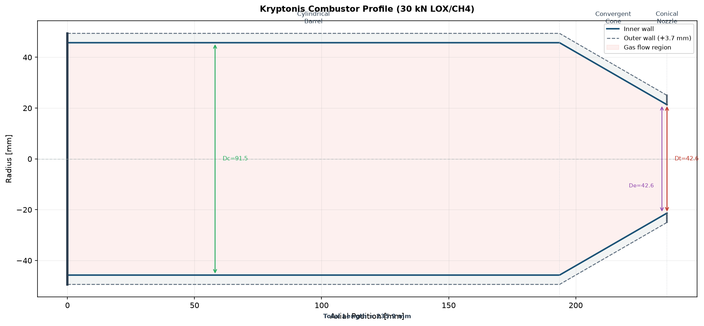

# Navronis (`navronis-propulsion`)

<div align="center">

[](https://opensource.org/licenses/Apache-2.0)
[](https://python.org)
[](#verification--testing)
[](#primary-literature--pedigree)

**An authority-controlled, first-principles liquid rocket preliminary propulsion analytical toolkit with primary literature provenance.**

[Key Capabilities](#key-capabilities) •
[4 Canonical Injector Families](#the-4-canonical-injector-families) •
[Quick Start](#quick-start) •
[CLI Usage](#command-line-interface) •
[Self-Explaining Provenance](#self-explaining-provenance) •
[CAD Export](#cad-export--visualization) •
[Architecture](#architecture--project-structure)

</div>

---

## Overview

Most preliminary rocket propulsion scripts in circulation rely on undocumented constants, uncalibrated combustion efficiencies, or misattributed empirical formulas.

**Navronis** is built on a strict mathematical foundation:
- **Zero Silent Defaults:** Inputs and intermediate results are strictly validated. Non-physical states (e.g. negative throat areas, sub-unity contraction ratios, negative injector pressure drops) fail explicitly rather than silently propagating errors.
- **Traceable Engineering Provenance:** Every computed parameter carries its governing equation, validity domain, and exact literature citation (NASA SP-125, NASA SP-194, Bartz 1957, Lorenzetto-Lefebvre 1977, Bazarov-Yang 1998, Dressler 2000, Rupe 1956).
- **Zero Heavy CFD/CAD Dependencies:** Pure Python, NumPy, and SciPy core. Runs instantaneously on Linux, macOS, and Windows.

---

## The 4 Canonical Injector Families

Rather than attempting to model dozens of niche injector variations, Navronis strictly focuses on the **4 canonical injector families** that power virtually all liquid rocket propulsion systems:

1. **Shear Coaxial Injectors (`coaxial`):** High-speed annular gas shears a central liquid core (e.g. SSME / RS-25, RL10, Vulcain, Raptor).
2. **Centrifugal Swirl Coaxial Injectors (`swirl`):** Tangential inlet ports create a rotating liquid film with a hollow central gas core, enveloped in an annular gas stream (e.g. RD-170, RD-180, NK-33).
3. **Central Pintle Injectors (`pintle`):** Continuous annular sheet deflected outward by an impinging central radial spray, providing wide throttling margins (e.g. Apollo LMDE, SpaceX Merlin 1D).
4. **Unlike Impinging Doublet Injectors (`impinging`):** Discrete intersecting liquid jets forming an atomizing spray fan (e.g. Apollo SPS, Titan II, Viking).

---

## Key Capabilities

Given high-level preliminary requirements (**Thrust, Chamber Pressure, Mixture Ratio, and Propellant Pair**), Navronis provides closed-form solutions for both **Thrust Chamber Assembly** and **Injector Head Subsystems**:

| Category | Equations / Methods | Literature Source | Output Quantities |
|---|---|---|---|
| **Mass Flow & Split** | Isentropic choked continuity: $\dot{m} = \frac{P_c A_t}{c^*}$ | NASA SP-125 Eq. (1-9) | Total $\dot{m}$, Fuel $\dot{m}_f$, Oxidizer $\dot{m}_{ox}$ |
| **Throat Sizing** | Choked sonic circular throat: $D_t = \sqrt{\frac{4 A_t}{\pi}}$ | NASA SP-125 Chapter 4 | Throat area $A_t$, diameter $D_t$ |
| **Chamber Geometry** | Contraction ratio: $\epsilon_c = \frac{A_c}{A_t} = 1.25 + 8.0 D_t^{-0.6}$ | Humble (1995) / SP-125 | Chamber area $A_c$, diameter $D_c$, ratio $\epsilon_c$ |
| **Chamber Volume & Barrel** | Volume $V_c = L^* A_t$, Barrel $L_{cyl} = \frac{V_c - V_{conv}}{A_c}$ | NASA SP-125 Eq. (4-4, 4-5) | Volume $V_c$, lengths $L_{conv}, L_{cyl}, L_c$ |
| **Residence Stay Time** | Bulk density stay time: $\tau_s = \frac{V_c \rho_c}{\dot{m}}$ | NASA SP-125 p.87 | Chamber stay time $\tau_s$ (ms) |
| **Hot-Gas Heat Transfer** | Boundary-layer corrected convective HTC: $h_g = f(D_t, P_c, c^*) \cdot \sigma$ | Bartz (1957) Jet Propulsion | Peak throat convective heat flux $q$ (MW/m²) |
| **Acoustic Instability Modes** | Exact Bessel roots: $f_{1T} = \frac{1.8412 a}{\pi D_c}$, $f_{1R}, f_{1L}$ | NASA SP-194 | 1T, 1R, and 1L cavity frequencies (Hz) |
| **Mechanical Wall Thickness** | Thin-shell hoop stress: $t_w = \frac{P_c R_c}{\sigma_{allow}}$ | ASME Section VIII Div 1 | Minimum & recommended wall thickness $t_w$ |
| **Injector Hydraulics & Decoupling** | Orifice flow $A_o = \frac{\dot{m}}{C_d\sqrt{2\rho\Delta P}}$, Stiffness $\frac{\Delta P}{P_c} \ge 0.15$ | NASA SP-194 / Huzel & Huang | Manifold $\Delta P$, orifice areas, velocities, chugging status |
| **Shear Coaxial Injectors** | Momentum flux ratio $J = \frac{\rho_g V_g^2}{\rho_l V_l^2}$, Lorenzetto-Lefebvre SMD | Yang et al. (2004) / Lefebvre | Post ID/OD, annulus gap, $J$, velocity ratio $VR$, $R_L$, droplet SMD $D_{32}$ |
| **Centrifugal Swirl Injectors** | Geometric swirl $K = \frac{\pi R_{in} r_o}{n A_p}$, Lefebvre (1989) sheet atomization | Bazarov & Yang (1998) / Lefebvre | Centrifugal orifice, gas core, film thickness, spray angle, SMD $D_{32}$ |
| **Pintle Injectors** | Total Momentum Ratio: $TMR = \frac{\dot{m}_{rad} V_{rad}}{\dot{m}_{ann} V_{ann}}$, $\beta = \arccos\left(\frac{1}{1+TMR}\right)$ | Dressler (2000) / Heister (2019) | Pintle diameter, radial slot height, gap thickness, $TMR$, cone angle $\beta$ |
| **Unlike Impinging Doublets** | Rupe momentum balance: $\frac{\rho_1 v_1^2 d_1}{\rho_2 v_2^2 d_2} = 1$, Ingebo atomization | Rupe (1956) JPL / Ingebo (1958) | Orifice diameters, jet velocities, free jet length, droplet SMD $D_{32}$ |

---

## Quick Start

### 1. Thrust Chamber Sizing API

```python
from kryptonis.propulsion_equations import CombustorDesign

# Define preliminary engine requirements
engine = CombustorDesign(
    thrust=30000.0,            # 30 kN
    chamber_pressure=12.0e6,    # 120 bar (12.0 MPa)
    mixture_ratio=2.6,         # LOX / LCH4
    propellant="LOX/CH4",
    convergent_half_angle_deg=30.0,
)

# Execute closed-form analytical sizing
result = engine.solve()

# Inspect outputs
print(f"Total Mass Flow:   {result.total_mass_flow:.2f} kg/s")
print(f"Throat Diameter:   {result.throat_diameter * 1000:.2f} mm")
print(f"Chamber Diameter:  {result.chamber_diameter * 1000:.2f} mm")
print(f"Total Chamber Lc:  {result.chamber_length * 1000:.2f} mm")
print(f"Peak Heat Flux:    {result.heat_flux_screen / 1e6:.2f} MW/m²")
print(f"1T Acoustic Buzz:  {result.acoustic_modes['1T_Hz']:.1f} Hz")
print(f"Min Wall (Cu-Cr):  {result.wall_thickness_screen * 1000:.2f} mm")
```

### 2. Injector Head & Atomization API

```python
from kryptonis.propulsion_equations import InjectorDesign

# Size a 19-element shear coaxial injector head for 30 kN LOX/CH4 engine
injector = InjectorDesign(
    injector_type="coaxial",
    chamber_pressure=12.0e6,     # 120 bar (12.0 MPa)
    mass_flow_ox=7.46,           # kg/s LOX
    mass_flow_fuel=2.87,         # kg/s LCH4
    rho_ox=1141.0,               # kg/m³
    rho_fuel=422.0,              # kg/m³
    n_elements=19,
    delta_p_ratio=0.20,          # 20% Pc injector drop (NASA SP-194)
)
inj_result = injector.solve()

# Inspect outputs
print(f"Liquid Post ID:    {inj_result['post_id_mm']:.2f} mm")
print(f"Annular Gas Gap:   {inj_result['annular_gap_mm']:.2f} mm")
print(f"Momentum Ratio J:  {inj_result['momentum_flux_ratio_J']:.2f}  [Stable window: 2 - 20]")
print(f"Droplet SMD D32:   {inj_result['smd_um']:.1f} µm (Lorenzetto-Lefebvre)")
print(f"Chugging Margin:   {'PASS (>=15%)' if inj_result['chugging_margin_adequate'] else 'FAIL'}")
```

### 3. Self-Explaining Provenance

Query the mathematical formulation, physical assumptions, and literature source of any output directly:

```python
print(result.explain("throat_diameter"))
```

```text
Quantity:     throat_diameter
Value:        0.0426 m (42.65 mm)
Equation:     D_t = sqrt(4 * A_t / pi)
Source:       NASA SP-125 Chapter 4 / Huzel & Huang
Status:       PRELIMINARY_DESIGN
Assumptions:  Axisymmetric circular sonic throat
```

---

## Command-Line Interface (CLI)

Navronis provides standalone command-line tools (`navronis` and `kryptonis-chamber`):

```bash
# 1. Size combustor chamber (30 kN LOX/CH4 at 120 bar)
navronis --subsystem chamber --thrust 30000 --pc 120 --propellants LOX/CH4

# 2. Size a 19-element shear coaxial injector head
navronis --subsystem injector --injector-type coaxial --thrust 30000 --pc 120 --propellants LOX/CH4

# 3. Size a 19-element centrifugal swirl coaxial injector head
navronis --subsystem injector --injector-type swirl --thrust 30000 --pc 120 --propellants LOX/CH4

# 4. Size a throttleable central pintle injector
navronis --subsystem injector --injector-type pintle --thrust 30000 --pc 120 --propellants LOX/CH4

# 5. Size a 16-element unlike impinging doublet injector
navronis --subsystem injector --injector-type impinging --thrust 30000 --pc 120 --propellants LOX/CH4
```

### Example Terminal Output: Injector Sizing (`--subsystem injector`)

```text
==============================================================================
NAVRONIS PROPULSION -- INJECTOR SIZING REPORT: COAXIAL
Propellant: LOX/CH4 | Thrust: 30.0 kN | Pc: 120.0 bar
==============================================================================
Mass Flow: Total = 10.370 kg/s (LOX: 8.066 kg/s, Fuel: 2.304 kg/s)
Injector Delta P: 24.00 bar (20.0% Pc)
Chugging Decoupling Margin: PASS (>=15%)
------------------------------------------------------------------------------
Elements:                  19
Liquid Post ID:            2.86 mm
Liquid Post OD:            3.86 mm
Gas Sleeve ID:             5.46 mm
Annular Gap:               0.80 mm
Liquid Ox Velocity:        65.86 m/s
Gas/Fuel Velocity:         104.99 m/s
Momentum Flux Ratio J:     9.35  [Target: 2.0 - 20.0]
Velocity Ratio VR:         1.59
Recess Length:             2.86 mm
Droplet SMD (D32):         24.3 µm
==============================================================================
```

### Example Terminal Output: Combustor Sizing (`--subsystem chamber`)

```text
==============================================================================
           NAVONIS PROPULSION ENGINE SIZER -- COMBUSTOR PRELIMINARY DESIGN
==============================================================================
Inputs:
  Thrust:                30.00 kN (30000 N)
  Chamber Pressure (Pc): 120.00 bar (12.00 MPa)
  Propellants:           LOX/CH4 (gamma=1.20, Tc=3450 K, Mw=22.0 g/mol)
  Characteristic L*:     1.00 m
------------------------------------------------------------------------------
1. THROAT & CHAMBER SIZING (NASA SP-125 / Huzel & Huang)
------------------------------------------------------------------------------
  Throat Area (At):            14.29 cm^2
  Throat Diameter (Dt):        42.65 mm
  Contraction Ratio (eps_c):    4.60
  Chamber Area (Ac):           65.73 cm^2
  Chamber Diameter (Dc):       91.48 mm
  Chamber Volume (Vc):         1.429 liters
------------------------------------------------------------------------------
2. AXIAL PROFILE & STAY TIME
------------------------------------------------------------------------------
  Convergent Half-Angle:        30.0 deg
  Convergent Length (Lconv):   42.29 mm
  Cylindrical Barrel (Lcyl):  193.62 mm
  Total Chamber Length (Lc):  235.91 mm
  Mean Stay / Res. Time:        1.35 ms
------------------------------------------------------------------------------
3. ACOUSTIC STABILITY FREQUENCIES (NASA SP-194)
------------------------------------------------------------------------------
  Chamber Speed of Sound:     1250.9 m/s
  1st Tangential Mode (1T):   8013.7 Hz  [Primary transverse buzz]
  1st Radial Mode (1R):      16677.3 Hz
  1st Longitudinal (1L):      2651.1 Hz  [Chugging / organ-pipe coupling]
------------------------------------------------------------------------------
4. MECHANICAL INTEGRITY (ASME Sec VIII / Thin-Shell Hoop)
------------------------------------------------------------------------------
  Material Yield Strength:     280.0 MPa (SF: 1.5)
  Min Wall Thickness:           2.94 mm
  Recommended Thickness:        3.68 mm (+25% machining margin)
==============================================================================
Execution complete. 100% first-principles closed-form analytical solutions.
==============================================================================
```

---

## CAD Export & Visualization

### 1. 2D Axial Contour Plotting
Generate dimensioned, publication-ready cross-section plots with cosmetic wall thickness:

```python
result.plot(save_path="combustor_profile.png")
```

<div align="center">
  
</div>

### 2. Multi-Format CAD Export
Export calculated coordinate arrays and design parameters for CAD packages:

```python
result.to_json("combustor.json")   # Ingestion into CadQuery, OpenSCAD, or FreeCAD
result.to_csv("combustor.csv")     # Spreadsheets, MATLAB, FreeCAD Draft Workbench
```

---

## Architecture & Project Structure

```text
Navronis/
├── src/
│   └── kryptonis/
│       └── propulsion_equations/
│           ├── __init__.py           # Unified top-level API
│           ├── combustor.py          # High-level CombustorDesign & CombustorResult
│           ├── injector.py           # InjectorDesign, Coaxial, Pintle & Impinging atomization
│           ├── chamber.py            # NASA SP-125 throat, contraction & volume equations
│           ├── combustion.py         # Characteristic velocity c* & stay time
│           ├── bartz.py              # Canonical Bartz 1957 convective film coefficient
│           ├── chamber_acoustics.py  # NASA SP-194 Bessel acoustic cavity modes
│           ├── profile.py            # Axial (x, r) coordinate inner-wall generator
│           ├── plotting.py           # Matplotlib 2D cross-section contour visualizer
│           ├── export.py             # Structured JSON & CSV profile exporters
│           ├── units.py              # Strongly-typed Result, Status & provenance containers
│           ├── aerodynamics.py       # 1D isentropic gas dynamics Area-Mach solver
│           ├── thermal.py            # Single-phase convective correlations (Sieder-Tate, Ito)
│           ├── wall_conduction.py    # 1D radial Fourier heat conduction
│           └── cli.py                # Standalone terminal console script (navronis / kryptonis-chamber)
├── examples/
│   ├── combustor_30kn.py             # Flagship 30 kN LOX/CH4 sizing example
│   ├── 01_thrust_chamber_sizing.py   # SP-125 analytical chamber sizing
│   ├── 02_bartz_heat_flux.py         # Throat convective heat flux & conduction
│   ├── 03_regenerative_cooling.py    # Cooling channel friction & curvature
│   ├── 04_nozzle_divergence_and_separation.py # Gas dynamics & separation limits
│   └── 05_injector_sizing.py         # Shear coaxial, pintle & doublet sizing for 30 kN Methalox
├── tests/                            # 26 automated unit tests (100% pass rate)
├── docs/assets/                      # Dimensioned plots and figures
├── pyproject.toml                    # PEP 621 standard package build metadata
└── LICENSE                           # Apache-2.0 open-source license
```

---

## Primary Literature & Pedigree

All formulations cite their original peer-reviewed or technical monograph source:
- **Chamber Sizing & Geometry:** Huzel & Huang, *Design of Liquid Propellant Rocket Engines* (NASA SP-125).
- **Contraction Ratio Correlation:** Humble, *Space Propulsion Analysis and Design*, McGraw-Hill (1995).
- **Hot-Gas Convective Heat Transfer:** Bartz, D. R. (1957), *A Simple Equation for Rapid Estimation of Rocket Nozzle Convective Heat Transfer Coefficients*, Jet Propulsion 27(1).
- **Chamber Acoustic Instability & Chugging:** Harrje & Reardon (Eds.), *Liquid Propellant Rocket Combustion Instability* (NASA SP-194).
- **Shear Coaxial Injectors & Atomization:** Yang, V. et al. (2004), *Liquid Rocket Thrust Chambers: Aspects of Modeling, Analysis, and Design*; Lorenzetto & Lefebvre (1977), *Measurements of Drop Size on Atomization by High-Velocity Gas Rays*.
- **Swirl Coaxial Injectors & Sheet Breakup:** Bazarov, V. G. & Yang, V. (1998), *Liquid-Propellant Rocket Engine Injectors*, AIAA J. Prop. & Power 14(5); Lefebvre, A. H. (1989), *Atomization and Sprays*, Hemisphere Publishing.
- **Pintle Injector Mechanics:** Dressler, G. A. (2000), *Summary of Deep Throttling Rocket Engines*, AIAA-2000-3873; Heister et al. (2019), *Rocket Propulsion*, Cambridge University Press.
- **Impinging Jet Atomization:** Rupe, J. H. (1956), *A Correlation Between Orifice Geometry and Mixing Performance of Impinging Streams*, JPL Report No. 20-80; Ingebo, R. D. (1958), *Drop-Size Distributions for Impinging-Jet Breakup in Airstreams*, NACA TN 4222.
- **Structural Hoop Stress:** ASME Boiler and Pressure Vessel Code, Section VIII, Division 1.

---

## Scope & Limitations

> [!IMPORTANT]
> **Navronis is a preliminary engineering calculation toolkit.**
> - It does **NOT** design manufacturing-ready rocket engines.
> - It is **NOT** a substitute for 3D reacting CFD, conjugate heat transfer (CHT), or finite element structural analysis (FEA).
> - Acoustic modes are **frequencies only**, not a dynamic stability assessment (which requires hardware-measured injector response functions $n$ and $	au$).

---

## Installation

```bash
git clone https://github.com/Ritik27Payak/Navronis.git
cd Navronis
pip install -e .
```

To include plotting dependencies:
```bash
pip install -e ".[dev]"
```

Run test suite:
```bash
pytest tests/ -v
```

---

## License

This project is licensed under the **Apache License 2.0** — see the [LICENSE](LICENSE) file for details.
